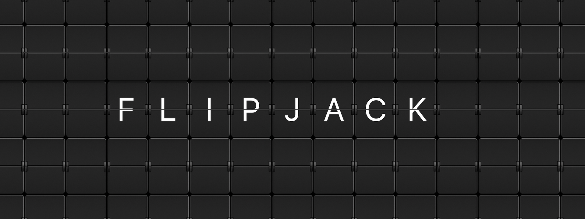
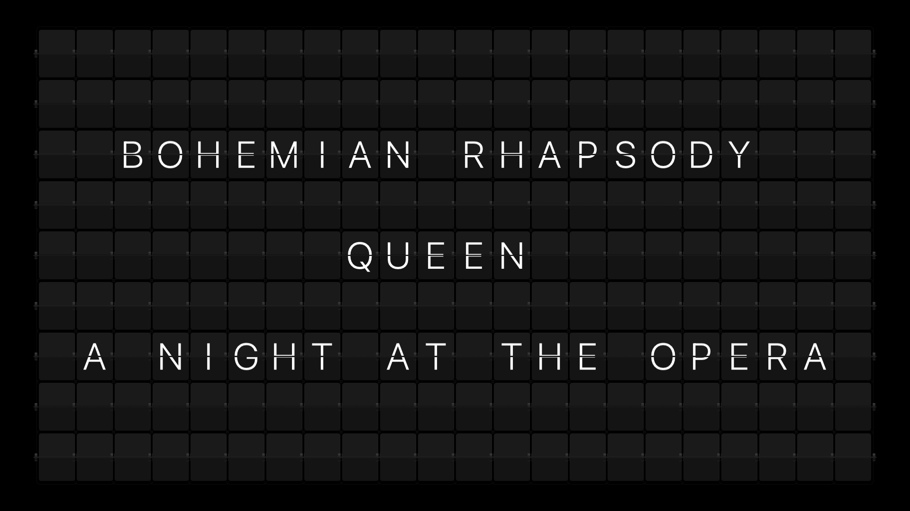
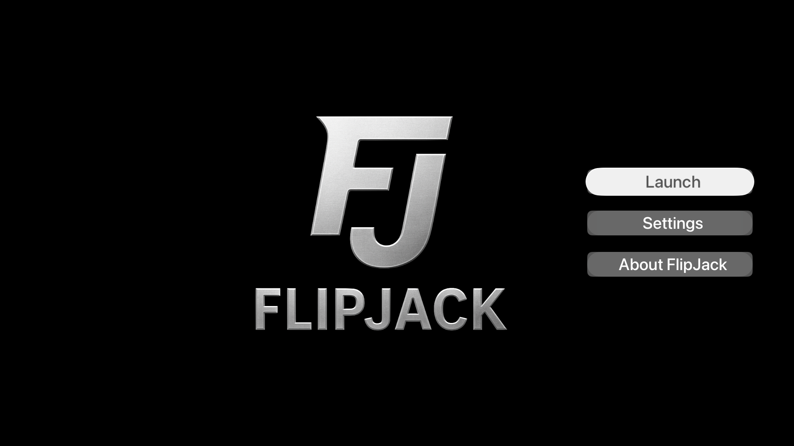
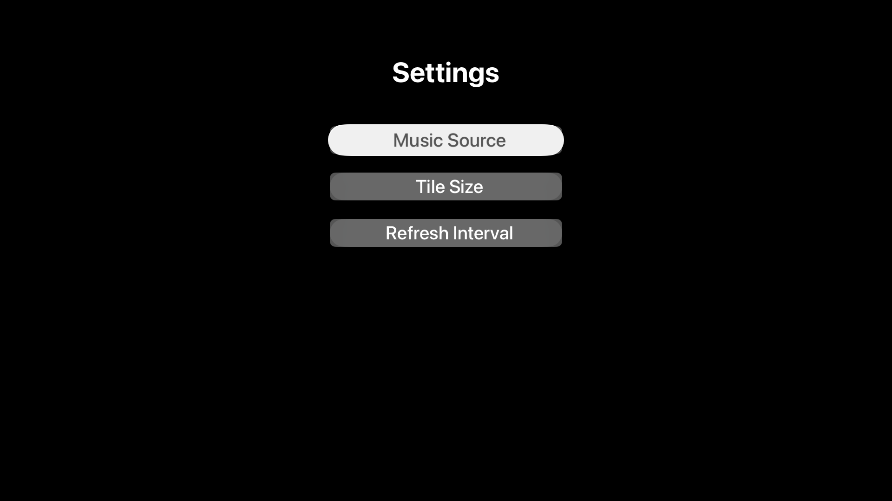

# FlipJack

**Now playing. Flip by flip.**  
FlipJack transforms your Apple TV into a vintage split-flap departure board, animated, alive, and always in tune.

## Your Apple TV just became the most stylish display in the room

FlipJack transforms your television into a stunning split-flap departure board, the kind you remember from old airports and train stations, showing exactly what's playing right now, flip by flip.

Every song change triggers a mesmerizing board animation, cycling through letters and landing on your track's title, artist, and album with satisfying mechanical precision.

## Features

- 9 unique board animations, including spiral, hatch, snake, diagonal wave, dissolve, and more
- Authentic split-flap physics with bounce landings, dynamic shadows, and a highlight flash on every flip
- GPU-accelerated animation across the full board for smooth performance at any grid size
- Supports Apple Music, Spotify, Last.fm, and Roon
- Last.fm support means Tidal and Qobuz listeners are covered too
- 5 grid sizes, from cinematic wide to dense airport-style
- Full Siri Remote control so you can skip tracks, play, and pause without leaving the display
- Clean "nothing playing" mode so the board always looks great

## See FlipJack in Action

### Main Display

### Main Menu

### Settings

## Music Sources

FlipJack supports multiple ways to bring your music to the board:

- Apple Music
- Spotify
- Last.fm
- Roon

With Last.fm support, FlipJack can also work beautifully for Tidal and Qobuz listeners.

## Support Pages

- [Support](./support)
- [FlipJack Privacy Policy](./privacy)
- [Using Qobuz with FlipJack via Last.fm](./using-qobuz-with-flipjack-via-lastfm)
- [Using Tidal with FlipJack via Last.fm](./using-tidal-with-flipjack-via-lastfm)
- [FlipJack Roon Bridge Instructions](./flipjack-roon-bridge-instructions)

## Why FlipJack

FlipJack is pure nostalgia, reimagined for the music you love today.

Whether music is playing in the background during dinner, filling the room at a party, or setting the tone for a quiet evening, FlipJack turns your Apple TV into a living display that feels tactile, cinematic, and alive.

## Contact

For support, bug reports, or feature requests, please contact:

**Email:** support@flipjack.us

Developer: Jeremy Hines
